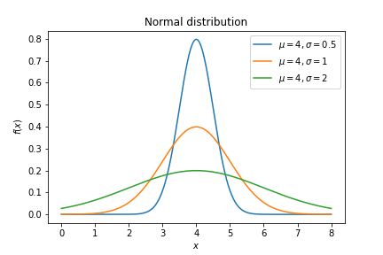
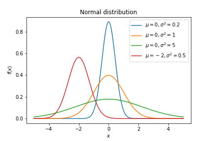
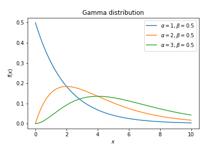
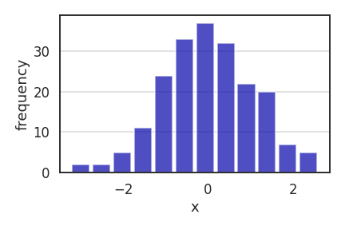
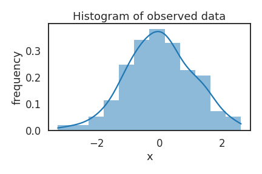

# Probability distributions

## Normal Gaussian distributon

The PDF of a normal distirbution with mean $\mu$ and standard deviation $\sigma$ is given by

$$
f(x) = \frac{1}{\sigma \sqrt{2\pi}} e^{-\frac{1}{2}(\frac{x-\mu}{\sigma})^2} .
$$

## Multivariate Gaussian distribution

The multivariate normal distribution or joint normal distribution generalises univariate normal distribution to more variables or higher dimensions.

$$
f_{\mathbf X}(x_1,\ldots,x_k) = \frac{\exp\left(-\frac 1 2 ({\mathbf x}-{\boldsymbol\mu})^\mathrm{T}{\boldsymbol\Sigma}^{-1}({\mathbf x}-{\boldsymbol\mu})\right)}{\sqrt{(2\pi)^k|\boldsymbol\Sigma|}}
$$

where x is a real ''k''-dimensional column vector and $|\Sigma|$ is the determinant of symmetric covariance matrix $\Sigma$ which is positive definite. Multivariate normal distribution reduces to univariate normal distribution if $\Sigma$ is a single real number.

The bivariate case is given by

$$
    f(x,y) =
      \frac{1}{2 \pi  \sigma_X \sigma_Y \sqrt{1-\rho^2}}
      \exp\left(
        -\frac{1}{2(1-\rho^2)}\left[
          \frac{(x-\mu_X)^2}{\sigma_X^2} +
          \frac{(y-\mu_Y)^2}{\sigma_Y^2} -
          \frac{2\rho(x-\mu_X)(y-\mu_Y)}{\sigma_X \sigma_Y}
        \right]
      \right)
$$

## Gamma distribution

A continuous random variable $x$ is said to have a gamma distribution with parameters $\alpha$ and $\beta$ as shown below.

$f(x;\alpha,\beta) = \frac{ \beta^\alpha x^{\alpha-1} e^{-\beta x}}{\Gamma(\alpha)}$

$\text{ for } x > 0 \quad \alpha, \beta > 0$

where $\Gamma(n) = (n-1)!$

## Bernoulli distribution

Bernoulli distribution is a discrete probability distribution which takes the value 1 with probability $p$ and the value 0 with probability $q=1-p$ which can be used for modelling binary classification problems. Hence, the probability mass function for this distribution over $k$ possible outcomes is given by
$$f(k;p) = p^k (1-p)^{1-k} \quad \text{for } k\in{0,1}$$

## Binomial distribution

The probability of getting exactly ''k'' successes in ''n'' independent Bernoulli trials is given by  
$$f(k,n,p) = \Pr(k;n,p) = \Pr(X = k) = \binom{n}{k}p^k(1-p)^{n-k}$$
for $k = 0, 1, 2, ..., n$, where $\binom{n}{k} =\frac{n!}{k!(n-k)!}$.

## Multinomial distribution

We consider an experiment of extracting n balls of k different colours from a bag and replacing the extracted ball after each draw. The balls of the same colour are equivalent. The number of extracted balls of colour i (i = 1, ..., k) as $X_i$, and denote as $p_i$ the probability that a given extraction will be in color $i$. The probability mass function for this distribution is given by

$$
\begin{aligned}
f(x_1, \ldots, x_k; n, p_1, \ldots, p_k) &= \Pr(X_1 = x_1, \ldots, X_k = x_k)  \\
                                         &= \begin{cases}
                                            \frac{n!}{x_1! \ldots x_k!} p_1^{x_1} \times \ldots \times p_k^{x_k} & \sum_{i=1}^{k} x_i = n \\
                                            0 & \text{otherwise}
                                           \end{cases}.
\end{aligned}
$$
